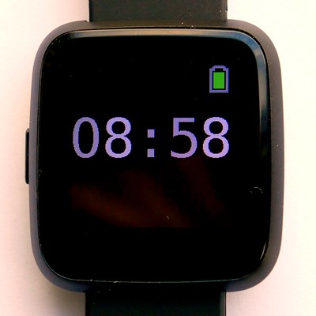
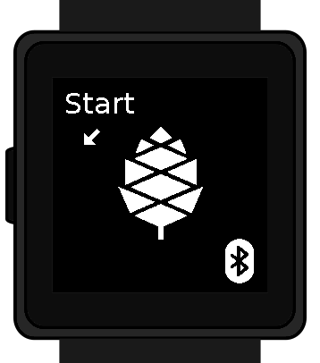
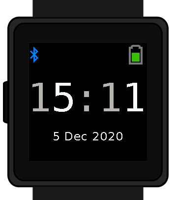
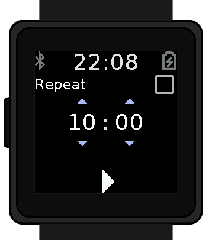
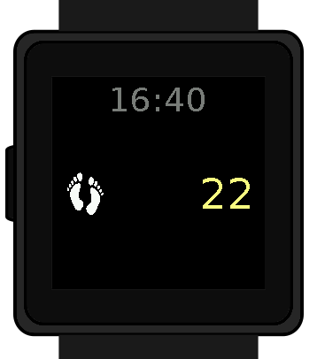
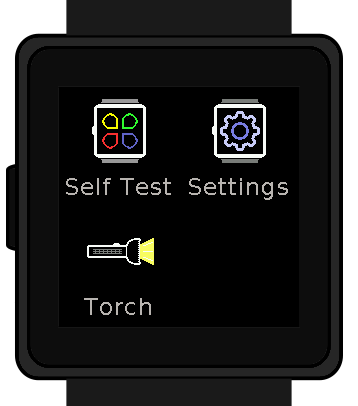
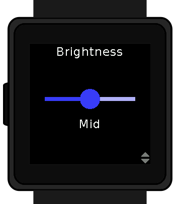
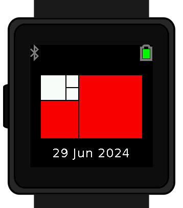
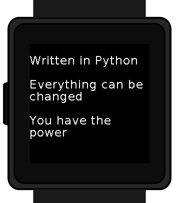
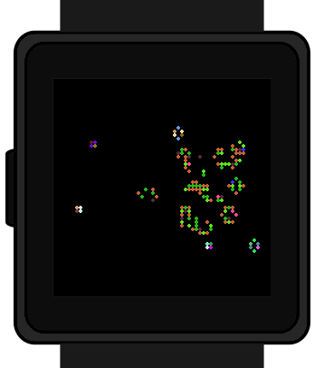

Watch Application System in Python
==================================

Introduction
------------

Although still in its infancy wasp-os provides many example applications
including a simple digital clock, a stopwatch, a step counter and a heart rate
monitor. All of these, together with access to the MicroPython REPL for
interactive tweaking and testing, are running on `PineTime
<https://www.pine64.org/pinetime/>`_.  It keeps time well and has enough power
saving functions implemented that it can survive for well over 72 hours between
charges so even at this early stage it is functional as a wearable timepiece.

Wasp-os includes a robust bootloader based on the Adafruit NRF52
Bootloader. It has been extended to make it robust for development on
form-factor devices without a reset button, power switch, SWD debugger
or UART. This allows us to confidently develop on sealed devices relying
only on BLE for updates.

Documentation
-------------

Wasp-os is has `extensive documentation <https://wasp-os.readthedocs.io>`_
which includes a detailed `Application Writer's Guide
<https://wasp-os.readthedocs.io/en/latest/appguide.html>`_ to help you
get started coding for wasp-os as quickly as possible.

Getting Started
---------------

Wasp-os can be installed without using any tools onto the following
devices:

 * Pine64 PineTime (developer edition)
 * Colmi P8

The
`Installation Guide <https://wasp-os.readthedocs.io/en/latest/install.html>`_
contains detailed instructions on how to build and install wasp-os.

At the end of the install process your watch will show the time (03:00)
together with a date and battery meter. When the watch goes into power
saving mode you can use the button to wake it again.

At this point you will also be able to use the Nordic UART Service to
access the MicroPython REPL. You can use ``tools/wasptool --console``
to access the MicroPython REPL.

To set the time and restart the main application:

.. code-block:: python

   ^C
   watch.rtc.set_localtime((yyyy, mm, dd, HH, MM, SS))
   wasp.system.run()

Or just use:

.. code-block:: sh

   ./tools/wasptool --rtc

which can run these commands automatically.

As mentioned above there are many drivers and features still to be
developed, see the :ref:`Roadmap` for current status.

Videos
------

.. list-table::

   * - .. figure:: https://img.youtube.com/vi/lIo2-djNR48/0.jpg
          :target: https://www.youtube.com/watch?v=lIo2-djNR48
          :alt: wasp-os: Open source heart rate monitoring for Pine64 PineTime
          :width: 95%

          `Open source heart rate monitoring for Pine64 PineTime <https://www.youtube.com/watch?v=lIo2-djNR48>`_

     - .. figure:: https://img.youtube.com/vi/YktiGUSRJB4/0.jpg
          :target: https://www.youtube.com/watch?v=YktiGUSRJB4
          :alt: An M2 pre-release running on Pine64 PineTime
          :width: 95%

          `An M2 pre-release running on Pine64 PineTime <https://www.youtube.com/watch?v=YktiGUSRJB4>`_

   * - .. figure:: https://img.youtube.com/vi/tuk9Nmr3Jo8/0.jpg
          :target: https://www.youtube.com/watch?v=tuk9Nmr3Jo8
          :alt: How to develop wasp-os python applications on a Pine64 PineTime
          :width: 95%

          `How to develop wasp-os python applications on a Pine64 PineTime <https://www.youtube.com/watch?v=tuk9Nmr3Jo8>`_

     - .. figure:: https://img.youtube.com/vi/kf1VHj587Mc/0.jpg
          :target: https://www.youtube.com/watch?v=kf1VHj587Mc
          :alt: Developing for Pine64 PineTime using wasp-os and MicroPython
          :width: 95%

          `Developing for Pine64 PineTime using wasp-os and MicroPython <https://www.youtube.com/watch?v=kf1VHj587Mc>`_

Screenshots
-----------

(An older version of) the digital clock application running on a Pine64 PineTime:

Screenshots of the built in applications running on the wasp-os
simulator (the "blank" screen is the torch application):

.. image:: res/HeartApp.png
   :alt: Heart rate application running on the wasp-os simulator
   :width: 179

.. image:: res/SelfTestApp.png
   :alt: Self test application running a rendering benchmark on the simulator
   :width: 179

.. image:: res/TorchApp.png
   :alt: Torch application running on the wasp-os simulator
   :width: 179

wasp-os also contains a library of additional applications for you to choose.
These are disabled by default but can be easily enabled by adding them
using one of the techniques is the Application Writer's guide.

