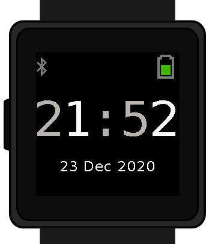
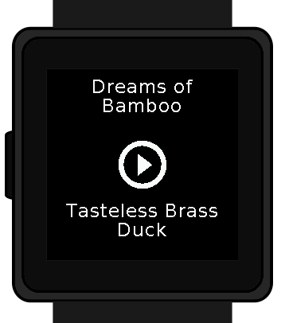
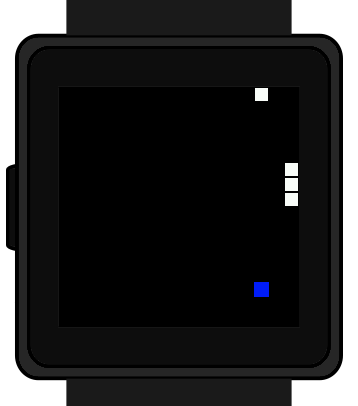

Watch Application System in Python
==================================

Introduction
------------

Wasp-os is a firmware for smart watches that are based on the nRF52 family of
microcontrollers, and especially for hacker friendly watches such as the Pine64
PineTime. Wasp-os features full heart rate monitoring and step counting support
together with multiple clock faces, a stopwatch, an alarm clock, a countdown
timer, a calculator and lots of other games and utilities. All of this, and
still with access to the MicroPython REPL for interactive tweaking, development
and testing.

Wasp-os comes fully integrated with a robust bootloader based on the Adafruit
NRF52 Bootloader. The bootloader has been extended to make it robust for
development on form-factor devices without a reset button, power switch, SWD
debugger or UART. This allows us to confidently develop on sealed devices
relying on Bluetooth Low Energy for over-the-air updates.

Documentation
-------------

Wasp-os is has `extensive documentation <https://wasp-os.readthedocs.io>`_
which includes a detailed `Application Writer's Guide
<https://wasp-os.readthedocs.io/en/latest/appguide.html>`_ to help you
get started coding for wasp-os as quickly as possible.

Getting Started
---------------

Wasp-os can be installed without using any tools or disassembly onto the
following devices:

 * Pine64 PineTime
 * Colmi P8
 * Senbono K9

Use the
`Installation Guide <https://wasp-os.readthedocs.io/en/latest/install.html>`_
to learn how to build and install wasp-os on these devices.

At the end of the install process your watch will show the time (03:00)
together with a date and a battery meter. When the watch goes into power
saving mode you can use the button to wake it again.

At this point you will also be able to use the Nordic UART Service to
access the MicroPython REPL. You can use ``tools/wasptool --console``
to access the MicroPython REPL.

To set the time and restart the main application:

.. code-block:: python

   ^C
   watch.rtc.set_localtime((yyyy, mm, dd, HH, MM, SS))
   wasp.system.run()

Or, if you have a suitable GNU/Linux workstation, just use:

.. code-block:: sh

   ./tools/wasptool --rtc

which can run these commands automatically.

As mentioned above there are many drivers and features still to be
developed, see the :ref:`Roadmap` for current status.

Community
---------

The wasp-os community is centred around the
`github project <https://github.com/daniel-thompson/wasp-os>`_ and is
supplemented with instant messaging via the #wasp-os IRC channel at
freenode.net.

If you are unfamiliar with IRC we recommend the
`offical freenode web client <https://webchat.freenode.net/#wasp-os>`_. Choose
a nickname, leave *I have a password* unchecked, set the *Channel* to
**#wasp-os** and click **Start**. That's it!

Videos
------

.. list-table::

   * - .. figure:: res/thumbnail-nps8Kd2qPzs.jpg
          :target: https://www.youtube.com/watch?v=nps8Kd2qPzs
          :alt: wasp-os: A tour of the new applications for wasp-os
          :width: 95%

          `A tour of the new applications for wasp-os <https://www.youtube.com/watch?v=nps8Kd2qPzs>`_

     - .. figure:: https://img.youtube.com/vi/lIo2-djNR48/0.jpg
          :target: https://www.youtube.com/watch?v=lIo2-djNR48
          :alt: wasp-os: Open source heart rate monitoring for Pine64 PineTime
          :width: 95%

          `Open source heart rate monitoring for Pine64 PineTime <https://www.youtube.com/watch?v=lIo2-djNR48>`_

   * - .. figure:: https://img.youtube.com/vi/YktiGUSRJB4/0.jpg
          :target: https://www.youtube.com/watch?v=YktiGUSRJB4
          :alt: An M2 pre-release running on Pine64 PineTime
          :width: 95%

          `An M2 pre-release running on Pine64 PineTime <https://www.youtube.com/watch?v=YktiGUSRJB4>`_

     - .. figure:: https://img.youtube.com/vi/tuk9Nmr3Jo8/0.jpg
          :target: https://www.youtube.com/watch?v=tuk9Nmr3Jo8
          :alt: How to develop wasp-os python applications on a Pine64 PineTime
          :width: 95%

          `How to develop wasp-os python applications on a Pine64 PineTime <https://www.youtube.com/watch?v=tuk9Nmr3Jo8>`_

   * - .. figure:: https://img.youtube.com/vi/kf1VHj587Mc/0.jpg
          :target: https://www.youtube.com/watch?v=kf1VHj587Mc
          :alt: Developing for Pine64 PineTime using wasp-os and MicroPython
          :width: 95%

          `Developing for Pine64 PineTime using wasp-os and MicroPython <https://www.youtube.com/watch?v=kf1VHj587Mc>`_

     -

Screenshots
-----------

(An older version of) the digital clock application running on a Pine64
PineTime:

.. image:: res/clock_app.jpg
   :alt: wasp-os digital clock app running on PineTime
   :width: 233

Screenshots of the built in applications running on the wasp-os
simulator:

.. image:: res/Bootloader.png
   :alt: Bootloader splash screen overlaid on the simulator watch art
   :width: 179

.. image:: res/HeartApp.png
   :alt: Heart rate application running on the wasp-os simulator
   :width: 179

.. image:: res/StopclockApp.png
   :alt: Stop watch application running on the wasp-os simulator
   :width: 179

.. image:: res/StepsApp.png
   :alt: Step counter application running on the wasp-os simulator
   :width: 179

.. image:: res/LauncherApp.png
   :alt: Application launcher running on the wasp-os simulator
   :width: 179

.. image:: res/SettingsApp.png
   :alt: Settings application running on the wasp-os simulator
   :width: 179

.. image:: res/SoftwareApp.png
   :alt: Software selection app running on the wasp-os simulator
   :width: 179

wasp-os also contains a library of additional applications for you to choose.
These are disabled by default but can be easily enabled using the Software
application (and the "blank" white screen is a torch application):

.. image:: res/SelfTestApp.png
   :alt: Self test application running a rendering benchmark on the simulator
   :width: 179

.. image:: res/TorchApp.png
   :alt: Torch application running on the wasp-os simulator
   :width: 179

.. image:: res/ChronoApp.png
   :alt: Analogue clock application running in the wasp-os simulator
   :width: 179

.. image:: res/AlarmApp.png
   :alt: Alarm clock application running in the wasp-os simulator
   :width: 179

.. image:: res/CalcApp.png
   :alt: Calculator running in the wasp-os simulator
   :width: 179

.. image:: res/2048App.png
   :alt: Let's play the 2048 game (in the wasp-os simulator)
   :width: 179

.. image:: res/TimerApp.png
   :alt: Countdown timer application running in the wasp-os simulator
   :width: 179

.. image:: res/WordClkApp.png
   :alt: Shows a time as words in the wasp-os simulator
   :width: 179
